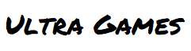

  

### 🎮 Ultra Games é um site desenvolvido durante minha graduação com finalidade de ser uma loja de jogos eletrônicos para consoles (Xbox One, PlayStation 4 e Switch). O objetivo de seu desenvolvimento se concentrou na aplicação de alguns conceitos de PDO do PHP, para isso, optou-se por ser um sistema que realiza um CRUD simples em suas operações.

## Pré-requisitos

Para executar o Ultra Games localmente, você precisa:

- Servidor MySQL;
- Servidor Apache para acessar o phpMyAdmin;

    **ou então**

- Programa que gerencie o servidor MySQL (como SQLyog).
 
 
Para ativar esses servidores, será preciso:
- Um ambiente para controlar servidores web (XAMPP, WampServer, etc.).

## ▶ Executando o sistema localmente

O seguinte tutorial será feito com base no XAMPP, ou seja, o banco de dados será importado através do phpMyAdmin. Existem outras maneiras possíveis de cumprir o mesmo 
processo, desde que seja importado um banco de dados MySQL com o nome **sice** através do arquivo **database.sql** no diretório raiz desse repositório.

1. Baixe ou clone o atual repositório em seu computador
2. Baixe e instale o XAMPP através do site https://www.apachefriends.org/pt_br/download.html
3. Após a instalação, no painel do XAMPP, inicie os serviços Apache e MySQL pelo botão "Start"

Para configurar o banco de dados e seu servidor:
1. Pelo navegador, entre no phpMyAdmin pelo link **localhost/phpmyadmin**
2. Na barra lateral à esquerda, clique na opção "Novo" e crie um banco de dados com o nome **ultragames**
3. Na barra superior, clique na opção "Importar" e selecione o arquivo **database.sql** com o botão "Escolher arquivo", este arquivo se encontra no diretório raiz
4. Role a página para baixo e clique no botão "Executar"

Para configurar o servidor Apache:
1. Localize a pasta onde o XAMPP está instalado. Por padrão, é no diretório C:\
2. Navegue até a pasta **htdocs**
3. Crie um pasta chamada **"ultragames"** e, para dentro dela, mova todos os arquivos do diretório raiz desse repositório
4. No seu navegador, digite **localhost/sice** e acesse a página inicial do sistema

Pronto! Agora você pode utilizar todos os recursos do Ultra Games. Lembre-se que, por se tratar de um sistema local, ele só funcionará enquanto os servidores do XAMPP estiverem ligados.

*Obs:* Caso possua alguma configuração diferente no seu servidor MySQL local, o arquivo que estabelece conexão com o banco de dados está na pasta **model/conectar-bd.php**

## 🛠 Tecnologias
- [HTML](https://www.w3schools.com/html/)
- [CSS](https://www.w3schools.com/css/)
  - [Bootstrap](https://getbootstrap.com/)
- [PHP](https://www.php.net/)
- [MySQL](https://www.mysql.com/)
